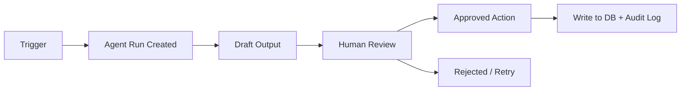

# Architecture - Morning Pic 369 Control Tower

> Status: Draft v1
> Created: 2026-07-08
> Basis: `SPEC.md`, `CLAUDE.md`, current `app.html`
> Note: This draft is inferred from existing project files because `SKILL_BRIEF.md` and `CONTEXT.md` are not present yet.

---

## 1. Direction We Are Taking

Current state:
- The app already works as a single-file local dashboard in `app.html`
- Data is stored in browser `localStorage`
- Core flows already exist: content, ads, chats, orders, production, reports
- The app already contains early agent-ready fields such as `assignedAgent`, `executionMode`, `agentStatus`

Next-layer goal:
- Keep the current frontend usable
- Add a backend sync layer without breaking local usage
- Move business data from local-only storage to a central database
- Open the path for AI agents to work on some tasks with human review

Chosen stack:
- Frontend: static HTML/CSS/JS
- Hosting: Cloudflare Pages
- Backend API: Cloudflare Worker
- Central database: Cloudflare D1
- File storage later: Cloudflare R2 or equivalent object storage
- AI agent orchestration later: Worker-driven jobs with async run records in DB

Why this path:
- It fits the existing static app best
- It lets us migrate gradually from `localStorage` to a shared database
- It keeps the first version simple enough for a one-owner business
- It supports future AI agent actions without moving all logic into the browser

---

## 2. Scope Confirmation

Working scope for this phase:

**Flow overall:** Browser app -> Sync Adapter -> Worker API -> Central DB -> Reports / Agent Jobs

**What stays now:**
- `app.html` remains the active UI
- local-first behavior remains available as fallback

**What gets added next:**
- one sync contract
- one central database schema
- one API layer
- one agent job model

This is the smallest stable bridge from local dashboard to shared operating system.

---

## 3. System Overview

```mermaid
graph TD
    A["Owner opens app.html"] --> B["Frontend App (HTML/CSS/JS)"]
    B --> C["Sync Adapter"]
    C --> D["Cloudflare Worker API"]
    D --> E[(("Central DB - D1"))]
    D --> F["Agent Job Runner"]
    F --> E
    E --> G["Operational Reports"]
    E --> H["Audit + Activity Log"]

    style D fill:#163b73,color:#fff
    style E fill:#ffb92b,color:#163b73
    style F fill:#ff7d1f,color:#fff
```

### Node meanings
- Frontend App: current dashboard UI
- Sync Adapter: browser-side layer that decides local save / queued sync / remote fetch
- Worker API: single backend entrypoint
- Central DB: shared business source of truth
- Agent Job Runner: future async worker for AI-assisted tasks
- Audit + Activity Log: traceability for human + AI actions

---

## 4. Transition Architecture

We should not jump from `localStorage` straight into fully remote-only mode.

### Phase A - Local-first with sync shape
- Keep `localStorage`
- Add record metadata:
  - `id`
  - `createdAt`
  - `updatedAt`
  - `syncStatus`
  - `lastSyncedAt`
  - `version`
- Add a browser-side outbox queue
- No real backend required yet for daily demo use

### Phase B - Hybrid sync
- App reads from local cache first
- App pushes writes to Worker API
- Worker writes to central DB
- App stores latest synced copy locally
- Sync conflicts are visible, not hidden

### Phase C - Central source of truth
- DB becomes primary source
- local cache remains for resilience and speed
- reports and agent runs read from DB, not browser memory

---

## 5. Data Domains

Main business domains already present in the app:
- settings
- packages
- businessTargets
- chats
- orders
- production
- contentPosts
- weeklyAdCreatives
- adCampaigns
- expenses
- cashReserve

New backend domains to add:
- sync_outbox
- activity_log
- agent_runs
- agent_handoffs
- file_assets

---

## 6. Central Database Model

This is the recommended first shared schema.

### Core tables

| Table | Purpose | Notes |
|---|---|---|
| `settings` | business-level configuration | usually one active row |
| `packages` | package catalog | `199`, `799`, `2999`, `5999`, add-ons |
| `business_targets` | monthly targets and guardrails | revenue, reserve, ad % cap |
| `chats` | inbound sales conversations | source, sent photo, offer, status |
| `orders` | sales orders | payment, billing, fulfillment |
| `production_jobs` | production work | images, owner, revisions, due date |
| `content_posts` | organic content plan/results | reach, chats, paid, revenue |
| `ad_creatives` | weekly ad pieces | angle, campaign link, outcomes |
| `ad_campaigns` | campaign performance | spend, chats, paid, revenue |
| `expenses` | operating costs | ads, production, tools |
| `cash_reserve` | reserve snapshots | saved/month, cumulative total |

### Cross-cutting tables

| Table | Purpose |
|---|---|
| `activity_log` | every business change from human or AI |
| `sync_outbox` | browser-originated unsynced changes |
| `agent_runs` | async AI tasks and outcomes |
| `agent_handoffs` | human review checkpoints |
| `file_assets` | references to uploaded product images, outputs, briefs |

### Shared columns for all mutable tables

Every mutable business table should include at least:
- `id`
- `created_at`
- `updated_at`
- `version`
- `created_by`
- `updated_by`
- `last_touched_by_type` (`human` / `agent` / `system`)
- `assigned_agent`
- `execution_mode`
- `agent_status`
- `handoff_note`

This matches the direction already started in `app.html`.

---

## 7. Sync Contract

The frontend should stop writing directly to many app-specific structures over time.
Instead, it should write through one sync contract.

### Browser-side record shape

```json
{
  "id": "ord-123",
  "entity": "orders",
  "payload": {},
  "version": 4,
  "syncStatus": "pending",
  "updatedAt": "2026-07-08T16:40:00+07:00",
  "updatedBy": "owner"
}
```

### Recommended sync states
- `local-only`
- `pending`
- `synced`
- `conflict`
- `failed`

### Sync operations
- `UPSERT_ENTITY`
- `DELETE_ENTITY`
- `BULK_PULL`
- `RESOLVE_CONFLICT`

### Conflict rule for v1
- Show conflict explicitly in UI
- Prefer human-confirmed merge
- Do not silently overwrite business records

---

## 8. API Surface

The Worker API should stay narrow at first.

### v1 endpoints

| Method | Path | Purpose |
|---|---|---|
| `GET` | `/api/bootstrap` | load all startup data for one business |
| `POST` | `/api/sync` | accept batched upsert/delete operations |
| `GET` | `/api/reports/summary` | fetch report aggregates |
| `POST` | `/api/agent-runs` | create agent job |
| `GET` | `/api/agent-runs/:id` | fetch job status/result |
| `POST` | `/api/uploads/presign` | future file upload flow |

### Why not one endpoint per module yet
- The business is still changing fast
- A sync-based contract reduces rewrite churn
- The frontend already behaves like one local state machine

---

## 9. AI Agent Model

AI should not directly mutate business records without traceability.

### Agent roles

| Agent | Scope |
|---|---|
| `Content Agent` | propose post ideas, fill content tasks, summarize results |
| `Ad Agent` | propose creative angles, monitor weak campaigns, suggest budget actions |
| `Sales Agent` | draft follow-up suggestions from chat state |
| `Production Agent` | detect delay risk, summarize blocked jobs |

### Agent run lifecycle



### Rules
- Agent suggestions are drafts by default
- Human approval is required for:
  - changing pricing
  - changing payment/billing states
  - sending customer-facing content
  - deleting or overwriting records
- Every approved agent action writes to `activity_log`

---

## 10. Data Flow

| Step | Actor | Action | Writes To |
|---|---|---|---|
| 1 | Owner | edits data in app | local app state |
| 2 | Sync Adapter | creates outbox event | `sync_outbox` local queue |
| 3 | Worker API | validates payload | API layer |
| 4 | Worker API | writes canonical record | central DB |
| 5 | Worker API | appends audit row | `activity_log` |
| 6 | Frontend | marks item synced | local cache |
| 7 | Agent trigger | creates agent run | `agent_runs` |
| 8 | Human review | approve/reject | `agent_handoffs`, business table |

---

## 11. Security and Ownership Model

For v1, assume:
- single business owner
- very small trusted team
- no public customer login

Recommended early model:
- one admin access boundary
- worker-side secret for AI provider
- no secrets stored in browser
- audit all write actions

Do not put into frontend:
- API keys
- AI provider tokens
- payment secrets
- customer private media URLs without access control

---

## 12. Setup Plan

- [ ] Step 1: keep `app.html` as UI baseline
- [ ] Step 2: add frontend `sync adapter` module shape inside the app or a split JS file
- [ ] Step 3: standardize every entity with shared metadata (`version`, `syncStatus`, timestamps)
- [ ] Step 4: define Worker API payload contract for `/api/bootstrap` and `/api/sync`
- [ ] Step 5: create central DB schema for core tables + audit + agent runs
- [ ] Step 6: migrate one domain first: `orders` + `production_jobs`
- [ ] Step 7: add activity logging for all remote writes
- [ ] Step 8: add first AI-assisted workflow as read-mostly: `Delay Radar`
- [ ] Step 9: add second AI-assisted workflow: `AI เนเธ•เธเธ‡เธฒเธ™เธˆเธฒเธเน€เธ›เน‰เธฒเธซเธกเธฒเธข` as draft-only
- [ ] Step 10: move reports to read from DB aggregates

---

## 13. Recommended Rollout Order

### Slice 1 - Backend foundation
- Sync adapter contract
- `bootstrap` + `sync` API
- DB tables: `orders`, `production_jobs`, `activity_log`

### Slice 2 - Shared operations
- Chats, content posts, ad campaigns, ad creatives
- conflict handling
- remote report aggregates

### Slice 3 - AI assist
- Delay radar agent
- goal-to-task breakdown agent
- approval workflow

### Slice 4 - Assets and collaboration
- file upload references
- richer audit history
- optional multi-user support

---

## 14. First Implementation Cut

If we start coding next, the safest first build is:

1. Extract a browser-side `sync service`
2. Normalize records with `version`, `updatedAt`, `syncStatus`
3. Add a fake adapter interface so the app can switch between:
   - `localStorageAdapter`
   - `remoteApiAdapter`
4. Implement only two synced domains first:
   - `orders`
   - `production_jobs`

Why these two first:
- they are central to money + delivery
- they already have business state transitions
- they are the best place to prove backend sync works

---

## 15. Edge Cases

| Case | Handling | Where |
|---|---|---|
| Browser offline | keep local changes in outbox | frontend sync adapter |
| Same record edited twice | compare `version`, mark conflict | Worker + frontend |
| Agent proposes bad update | require review before write | agent run workflow |
| Production marked delivered before payment review | allow but flag in audit | Worker business rules |
| Ad spend imported but revenue lags | keep raw metrics separate from derived summary | DB + report layer |

---

## 16. Recommended Next Files

After this architecture, the next practical deliverables should be:

- `sync-contract.md`
- `db-schema.sql`
- `api-contract.md`
- `phase-2-tasks.md`

---

## 17. Next Step

Best next move:
- create the sync contract and DB schema for the first slice
- start with `orders` and `production_jobs`

That gives us the first real bridge from local dashboard to shared backend without destabilizing the current app.
